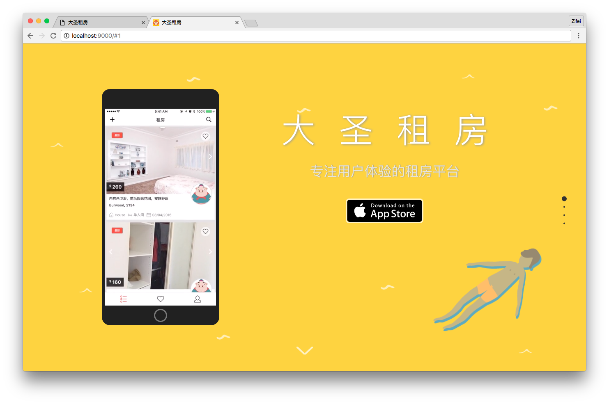
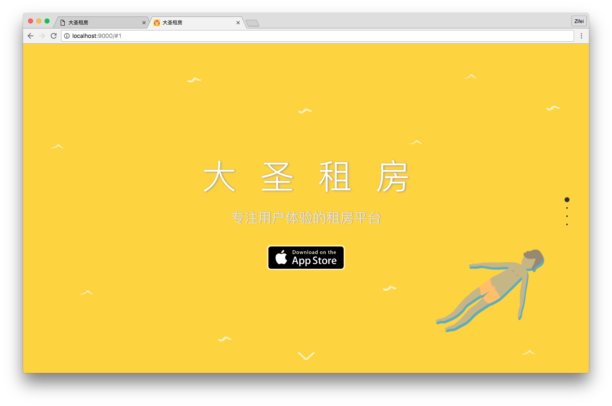

# fang-landing

# how to setup

run `npm install & bower install`
run `gulp serve` to start up server

# how to deploy

put everyting in `dist` folder in your host
in this case, we use github to hosting our static content (web pages), the gitub location is `https://github.com/iamzifei/app`

# how to record and convert screencast

* connect iPhone to Macbook, open `Quicktime`, choose `File => new movie recording`, choose iPhone as video source
* after record, save as `*.mov` file
* install ffmpeg by `brew install ffmpeg --with-libvpx`
* convert `mov` to `mp4` and `webm` by using the following command, adjust size accordingly
```
ffmpeg -i demo.mov -an -strict experimental -ac 2 -ab 128k -vcodec libx264 -f mp4 -crf 22 -s 240x426 demo.mp4
ffmpeg -i demo.mov -f webm -vcodec libvpx -an -ab 128000 -crf 22 -s 360x640 demo.webm
```

# how to remove the phone screencast in section 1, so the front page is full cover

with demo screencast:


without demo screencast:


remove the following part in `section1` part.
```
<div class="stage-smartphone section1" data-stage="1">
  <div class="phone">
    <video poster="images/demo.png" width="270" height="480" preload="auto" controls autoplay loop>
      <source src="videos/demo.mp4" type="video/mp4" />
      <source src="videos/demo.webm" type="video/webm" />
      Your browser does not support the video tag.
    </video>
  </div>
</div>
```

# color

猴子黄 #FED340
和尚红 #f44336
猪妖蓝 #06448C
水怪绿 #088D68

# Todo

* add screencast or screenshot to demo app feature [Sample](https://culturedcode.com/things/iphone/)
